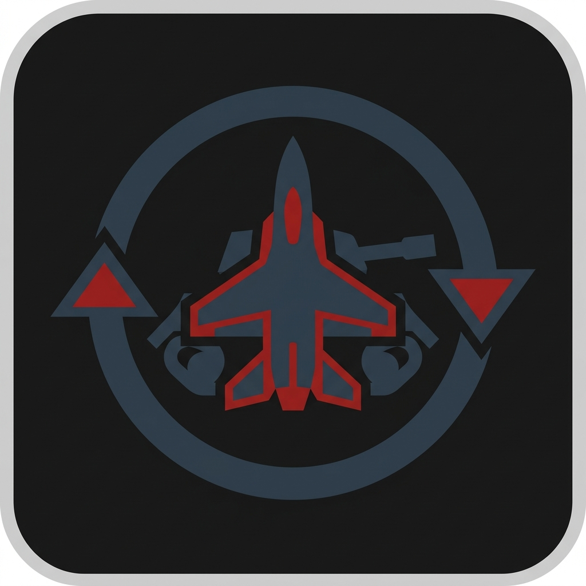

# War Thunder Account Switcher

🇷🇺 *[Русская версия ниже (Russian version below)](#русская-версия)*

A fast, safe, and open-source local account switcher for War Thunder. Works on **Windows, macOS, and Linux**.

Does **NOT** modify game files, hook into processes, or trigger anti-cheat. It simply swaps your local game settings and session tokens before launching the game, acting exactly as if you restored a valid local session state that War Thunder uses for auto-login.

## Features
- Save and switch between multiple accounts instantly via CLI or Desktop shortcuts.
- Toggles `pixelstorm` (CIS) and `gaijin` (Global) regions automatically based on the saved account.
- Disables autologin when running the vanilla launcher so you can safely log into a new account.
- **Windows**: Generates `WT Accounts` shortcuts on your Desktop.
- **macOS**: Can automatically generate scripts for [Raycast](https://www.raycast.com/).
- **Linux**: Works seamlessly with Steam Proton and native clients.

---

## Installation

### Windows
1. Download or clone this repository.
2. Go to the `windows` folder and run `install.bat`.
3. Open a new Command Prompt or PowerShell.
4. Run `wt config setup` and provide the paths to your Launcher and Game directories.

### macOS & Linux
1. Open terminal and clone this repository.
2. Run `cd mac-linux && ./install.sh`
3. Restart your terminal (or run `source ~/.zshrc` / `source ~/.bashrc`).
4. Run `wt config setup` and verify the detected paths.

*(Note: if using Raycast on Mac, enable generation by running `wt config raycast on`)*

---

## How to Use

1. Launch the game normally without autologin:
   - `wt` (for Pixelstorm/CIS region)
   - `wt global` (for Gaijin/Global region)
2. In the game, log into your account and check the **"Save Password"** box.
3. Close the game.
4. Open your terminal (or CMD/PowerShell) and save the session:
   - `wt save pix MyMainAcc`
   - `wt save global MyAltAcc`
5. Done! You can now switch to that account instantly:
   - In terminal: `wt MyMainAcc`
   - On Windows: Double-click the shortcut generated in the `Desktop/WT Accounts` folder.
   - On Mac (Raycast): Open Raycast and type `wt MyMainAcc`.

### Commands Reference

| Command | Description |
|---|---|
| `wt` | Launch WT (Pixelstorm) and force manual login |
| `wt global` (or `wtglobal`) | Launch WT (Global) and force manual login |
| `wt <name>` | Launch a saved account with autologin |
| `wt save pix <name>` | Save current session as a Pixelstorm account |
| `wt save global <name>`| Save current session as a Global account |
| `wt list` | List all saved accounts |
| `wt delete <name>` | Delete a saved account |
| `wt config setup` | Reconfigure paths to the game and launcher |
| `wt config autologin on/off` | Toggle whether saved accounts use autologin |
| `wt config raycast on/off` | (Mac only) Toggle Raycast script generation |

## How it works
1. War Thunder stores your local authentication state (`.warThunderProps.pblk` and `lastlogin.blk`) when you log in.
2. When you use `wt save`, the switcher copies this local state into a separate profile folder.
3. When you switch accounts via `wt <name>`, the switcher restores that specific profile back into the game directory.
4. The game is then launched normally. The switcher does not modify game binaries or interfere with its running process.

## Security model (Local-Only)
This tool is designed to be **safe by design** as a local utility:
* **Local-only**: All profiles are saved locally on your computer.
* **No network communication**: The switcher itself does not make network requests or upload user data. War Thunder and its launcher communicate with their own servers normally.
* **No backend**: It does not rely on or connect to any external services.
* **No telemetry**: There is zero tracking or analytics.
* **No process injection**: It does not intercept network traffic or modify the War Thunder process memory.
* **Open source**: You can inspect every line of code to verify its behavior.

## ⚠️ Trusting the tool
Because this tool manages your local authentication and session tokens, **you must trust the version you are running.** The open-source nature of this repository allows you to verify that it does not send your data anywhere. 
*Beware of closed-source forks, paid alternatives, or compiled `.exe` variants.* If you cannot read the source code, you cannot verify that the program isn't silently stealing your `.warThunderProps.pblk` token. Only use open-source tools for managing session data.

---

## Disclaimer
This is an unofficial community tool. It operates entirely locally and does not interact with the game's memory or network traffic. However, please be aware of Gaijin Entertainment's Terms of Service regarding multi-accounting. Use at your own risk.

---
---

# Русская версия

Быстрый, безопасный и открытый локальный менеджер аккаунтов для War Thunder. Работает на **Windows, macOS и Linux**.

Скрипт **НЕ** изменяет бинарные файлы игры, не внедряется в процессы и не триггерит античит (EAC). Он просто подменяет локальные файлы настроек и токены сессии до запуска игры, действуя так, будто вы восстановили валидное локальное состояние авторизации, которое War Thunder использует для автологина.

## Возможности
- Мгновенное сохранение и переключение между несколькими аккаунтами через консоль или ярлыки на рабочем столе.
- Автоматически переключает регионы между `pixelstorm` (СНГ) и `gaijin` (Глобал) в зависимости от сохраненного аккаунта.
- Автоматически отключает автологин при обычном запуске (чтобы вы могли спокойно войти в новый аккаунт).
- **Windows**: Генерирует удобные ярлыки в папке `WT Accounts` на рабочем столе.
- **macOS**: Умеет автоматически генерировать скрипты для [Raycast](https://www.raycast.com/).
- **Linux**: Отлично работает как с нативным клиентом, так и через Steam Proton.

---

## Установка

### Windows
1. Скачайте или склонируйте этот репозиторий.
2. Зайдите в папку `windows` и запустите `install.bat`.
3. Откройте новое окно Командной строки (CMD) или PowerShell.
4. Введите `wt config setup` и укажите пути к лаунчеру и папке с игрой.

### macOS и Linux
1. Откройте терминал и склонируйте репозиторий.
2. Выполните: `cd mac-linux && ./install.sh`
3. Перезапустите терминал (или выполните `source ~/.zshrc` / `source ~/.bashrc`).
4. Введите `wt config setup` и подтвердите предложенные пути (или укажите свои).

*(Примечание: если используете Raycast на Mac, включите генерацию скриптов командой `wt config raycast on`)*

---

## Как пользоваться

1. Запустите игру как обычно, без автологина:
   - `wt` (для региона Pixelstorm/СНГ)
   - `wt global` (для региона Gaijin/Global)
2. В самой игре войдите в нужный аккаунт и **обязательно поставьте галочку «Сохранить пароль»**.
3. Закройте игру.
4. Откройте терминал (или CMD/PowerShell) и сохраните текущую сессию:
   - `wt save pix MyMainAcc` *(для СНГ)*
   - `wt save global MyAltAcc` *(для Глобала)*
5. Готово! Теперь вы можете мгновенно заходить на этот аккаунт:
   - В терминале: `wt MyMainAcc`
   - На Windows: Двойным кликом по ярлыку в папке `WT Accounts` на рабочем столе.
   - На Mac (Raycast): Откройте Raycast и введите `wt MyMainAcc`.

### Список команд

| Команда | Описание |
|---|---|
| `wt` | Запустить WT (Pixelstorm) и принудительно запросить ручной логин |
| `wt global` (или `wtglobal`) | Запустить WT (Global) и принудительно запросить ручной логин |
| `wt <имя>` | Запустить сохраненный аккаунт (сработает автологин) |
| `wt save pix <имя>` | Сохранить текущую сессию как аккаунт Pixelstorm |
| `wt save global <имя>`| Сохранить текущую сессию как аккаунт Global |
| `wt list` | Показать список всех сохраненных аккаунтов |
| `wt delete <имя>` | Удалить сохраненный аккаунт |
| `wt config setup` | Заново настроить пути к игре и сохранениям |
| `wt config autologin on/off` | Включить/выключить автологин для сохраненных аккаунтов |
| `wt config raycast on/off` | (Только Mac) Включить/выключить генерацию скриптов Raycast |

## Как это работает
1. При входе в игру War Thunder сохраняет ваше локальное состояние авторизации (`.warThunderProps.pblk` и `lastlogin.blk`).
2. При использовании `wt save`, скрипт копирует это состояние в отдельную папку профиля.
3. При переключении через `wt <имя>`, скрипт восстанавливает нужный профиль обратно в папку игры.
4. После этого игра запускается обычным образом. Скрипт не изменяет бинарные файлы и не вмешивается в процесс игры.

## Модель безопасности (Local-Only)
Этот инструмент спроектирован так, чтобы быть **safe by design** в качестве локальной утилиты:
* **Только локально**: Все профили сохраняются только на вашем жестком диске.
* **Без сети**: Сам скрипт не делает никаких сетевых запросов и не отправляет пользовательские данные. War Thunder и его лаунчер общаются со своими серверами в штатном режиме.
* **Без бэкенда**: Утилита не зависит от внешних сервисов и не подключается к ним.
* **Без телеметрии**: Отсутствует любой сбор статистики.
* **Без инжектов**: Скрипт не перехватывает трафик и не читает память процесса War Thunder.
* **Открытый код**: Вы можете лично изучить каждую строчку кода.

## ⚠️ Кому доверять
Поскольку этот инструмент работает с вашими токенами сессий, **вы должны доверять той версии кода, которую запускаете.** Открытый исходный код этого репозитория позволяет вам самостоятельно убедиться, что программа ничего не крадёт.
*Осторожно с закрытыми форками, платными аналогами или скомпилированными `.exe` сборками.* Если вы не можете прочитать исходный код программы, вы не можете быть уверены, что она скрытно не копирует файл `.warThunderProps.pblk`. Доверяйте свои сессионные данные только открытому софту.

---

## Важное предупреждение
Это неофициальный фанатский инструмент. Он работает исключительно локально и никак не модифицирует память игры или сетевой трафик. Однако, согласно Пользовательскому соглашению (TOS) Gaijin Entertainment, создание нескольких аккаунтов запрещено. Вы используете этот скрипт на свой страх и риск.

## License
This project is provided under a [Non-Commercial Source-Available License](LICENSE). Commercial use and monetization are strictly prohibited.
